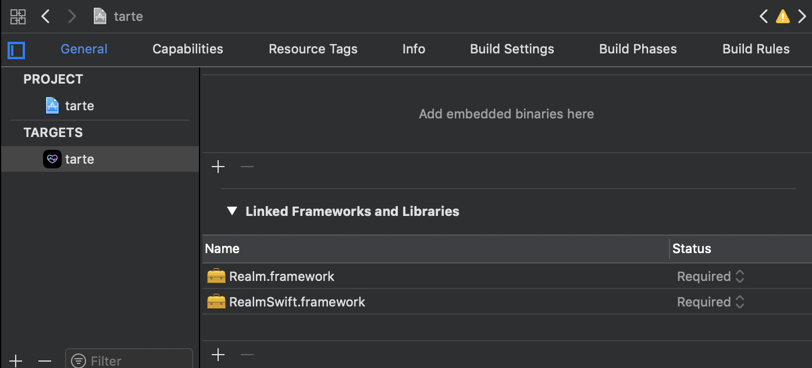
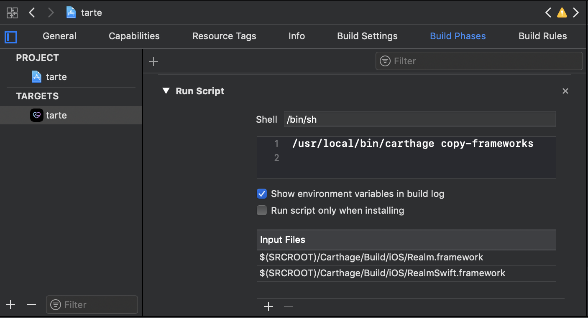

モバイル向けデータベース[Realm](https://realm.io/docs/swift/latest/)をライブラリ管理ツール[Carthage](https://github.com/Carthage/Carthage)を使って導入する手順

## 環境

```yaml
macOS: 10.14.2(Mojave)
xcode: 10.1
Carthage: 0.31.2
realm: 3.13.0
```

## Carthage導入

HomeBrewで導入する

```bash
brew install carthage
```

## Realm導入

[Realm](https://realm.io/docs/swift/latest/)に沿って入れる

まず、ライブラリ管理用のファイルを作成(RubyでいうGemfile)

```bash
touch Cartfile
```

インストールするライブラリ(今回はrealm)を追記

```bash
github "realm/realm-cocoa"
```

ライブラリをインストール

```bash
carthage update
```

と思ったらこんなエラーが出た

```bash
xcrun: error: unable to find utility "xcodebuild", not a developer tool or in PATH
```

xcodeの`Command Line Tools`が指定されてないことが原因なので、以下から設定する

```
xcodeのPreference -> Locations -> Command Line Tools
```

改めてインストール再開、20分ぐらい待機してやっと終わった。

```bash
❯ carthage update
*** Fetching realm-cocoa
*** Checking out realm-cocoa at "v3.13.0"
*** xcodebuild output can be found in /var/folders/2l/yf373k2j0b74ct3l842sw7tw0000gn/T/carthage-xcodebuild.bRRsq0.log
*** Skipped downloading realm-cocoa.framework binary due to the error:
	"Must specify two-factor authentication OTP code."
*** Building scheme "Realm" in Realm.xcworkspace
*** Building scheme "RealmSwift" in Realm.xcworkspace
```

## xcodeの設定にRealmを追加する

projectの`General`settings -> `Linked Frameworks and Libraries`
`RealmSwift.framework`と`Realm.framework`を追加する



次に、`Build Phases` -> `New Run Script Phase`に以下を追加
(App Storeへの送信バグを回避するための作業らしい)

```bash
/usr/local/bin/carthage copy-frameworks
```

`Input Files`のpathsに以下を追加

```bash
$(SRCROOT)/Carthage/Build/iOS/Realm.framework
$(SRCROOT)/Carthage/Build/iOS/RealmSwift.framework
```


