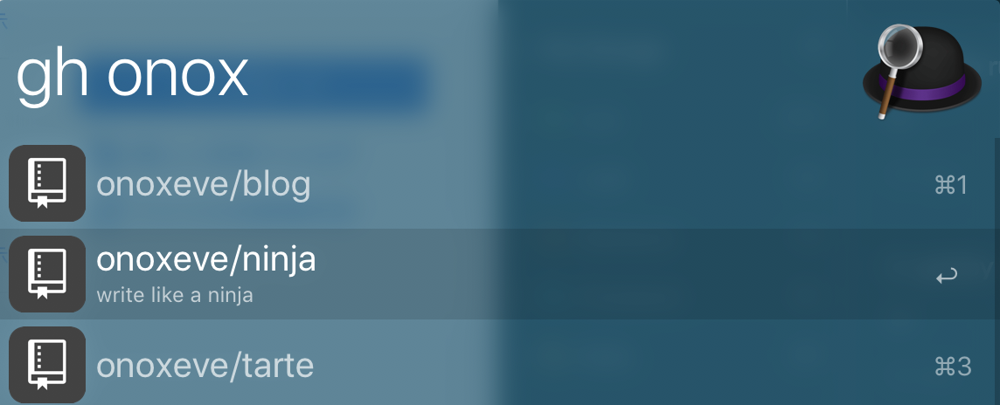
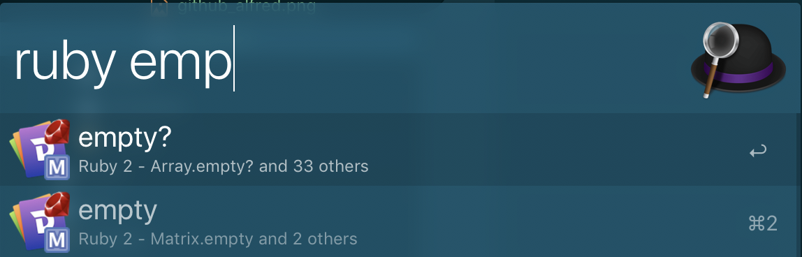
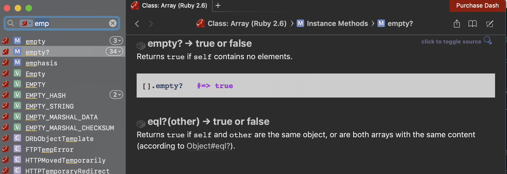

GithubレポジトリをSpotlight感覚で検索したいがために、[Alfred](https://www.alfredapp.com/)を導入した。  
[Alfred](https://www.alfredapp.com/)の`Download Alfred 3`からダウンロードする。

## Powerpack導入

GitHubレポジトリを検索するためには、アドオンのPowerpack購入が必要。(月額ではなく買い切り)
[ここから購入できる](https://www.alfredapp.com/powerpack/buy/)  
Powerpackを購入することで、様々な拡張機能(Workflowsと呼ばれている)を導入できる。(無料で利用できるWorkflowもある)

## とりあえず導入したWorkflows

### Github

Alfredからレポジトリなどを検索できるようにする  
[alfred-github-workflow](https://github.com/gharlan/alfred-github-workflow)

### Dash

rubyなど各種言語のリファレンスをAlfredから参照できるようになる  
[Dash-Alfred-Workflow](https://github.com/Kapeli/Dash-Alfred-Workflow)

1. [Dash](https://kapeli.com/dash)からダウンロード
2. Open Dash and go to Preferences > Integration > Alfred
3. Download -> 必要なdocをダウンロードする

## 複数PC間で同期する
`Advanced` -> `Syncing`より設定  
[同期速度の問題](https://www.alfredapp.com/help/advanced/sync/#services)で[Dropbox](https://www.dropbox.com/)を使うことが推奨されているので、Dropboxのアカウントを取得した。
