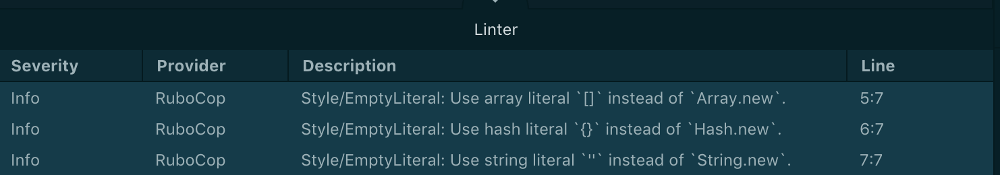

Atomにソースコード解析ツールのrubocopを入れる手順。コーディング規約は[cookpadさん](https://github.com/cookpad/styleguide/blob/master/.rubocop.yml)を参考にする。

## 環境

```yaml
Mojave: 10.14.2
Atom: 1.34.0
ruby: 2.6.0
# atom plugin
linter-rubocop: 2.2.3
linter: 2.3.0
```

## 1. rubyセットアップ

[rbenv](https://github.com/rbenv/rbenv)と[ruby-build](https://github.com/rbenv/ruby-build)を使用する前提

### rbenv/ruby-buildを最新化する
最新版のrubyがインストールできないため、upgradeしておく

```bash
brew upgrade && rbenv ruby-build
```

### rubyインストール

```bash
# インストール可能なversionを確認
# ここで欲しいversionが出力されない場合、ruby-buildのversionが古いと思われ
rbenv install --list

# vesion指定でinstall
rbenv install 2.6.0

# to global
rbenv global 2.6.0

# or

# to local
cd <特定のプロジェクト>
rbenv local 2.6.0
```

## 2. rubocopインストール

```bash
gem install rubocop
```

## 3. Atomセットアップ
[AtomLinter/linter-rubocop](https://github.com/AtomLinter/linter-rubocop)に沿って設定する。

### Pluginインストール

```bash
apm install linter linter-rubocop
```

### Plugin設定

linter-rubocop -> Settings -> Commandでrubocopの実行pathの修正をする。  
これでrubyのversionが変わっても参照先をよしなに変更してくれる。
```bash
# Rubocop shimを指定する
/Users/onox/.rbenv/shims/rubocop
```

## 3. rubocop設定

[rubocop](https://github.com/rubocop-hq/rubocop)はデフォルトで[ruby-style-guide](https://github.com/rubocop-hq/ruby-style-guide)を元にコードチェックを行う。  
別のファイルを元にしたい場合は、プロジェクトルート直下に`.rubocop.yml`を用意する。  
例えば、[cookpadさん](https://github.com/cookpad/styleguide/blob/master/.rubocop.yml)が独自のコーディング規約を公開している。

## 4. rubocop例
rubocopを導入するとどうなるか？の一例

例: 空のリテラルを定義する際のチェック

`rubocop.yml`
```yaml
Style/EmptyLiteral:
  Enabled: true
```

`ruby code`
```ruby
# bad
a = Array.new
h = Hash.new
s = String.new

# good
a = []
h = {}
s = ''
```

このようにアラートを出してくれる

